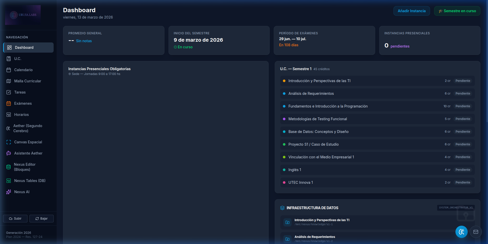
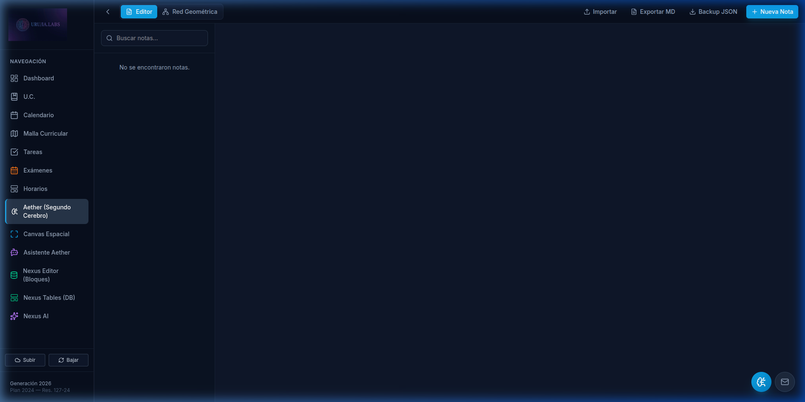
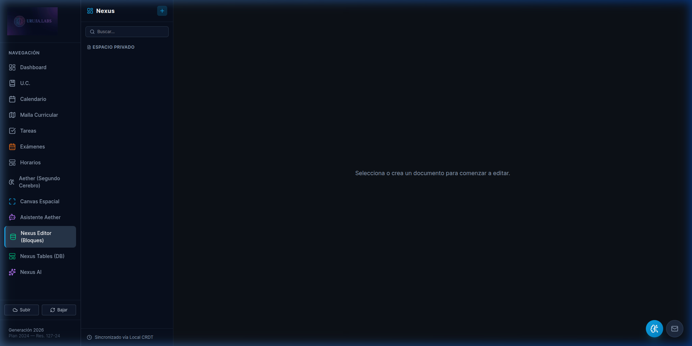

# Carrera LTI — UTEC Uruguay 🎓

Una **súper-app académica y de productividad** diseñada para estudiantes de la **Licenciatura en Tecnologías de la Información (Plan 2024)** de la **Universidad Tecnológica (UTEC) de Uruguay**.

Combina gestión académica, un Segundo Cerebro (Aether) y un Espacio de Trabajo Unificado con IA (Nexus) en una sola aplicación local-first y offline-ready. Desarrollada bajo la marca **URU/IA.LABS**.

---

## ✨ Características

### 📚 Gestión Académica
| Módulo | Descripción |
|--------|-------------|
| **Dashboard** | Resumen del semestre, cuenta regresiva, gráficos de progreso (Recharts) y promedio general |
| **Calendario** | Vista mensual/semanal de instancias presenciales, exportación `.ics` |
| **Malla Curricular** | Grid interactivo de 8 semestres con créditos y barra de progreso |
| **U.C.** | Gestión de materias: notas, estado, enlaces y recursos por unidad curricular |
| **Tareas** | Kanban avanzado con subtareas, prioridades, fechas y notificaciones push |
| **Horarios** | Generador visual drag-and-drop con `@dnd-kit` |

### 🧠 Aether (Segundo Cerebro)
| Módulo | Descripción |
|--------|-------------|
| **Bóveda** | Editor Markdown híbrido con enlaces bidireccionales `[[Wiki]]` |
| **Grafo de Conocimiento** | Visualización 2D de relaciones entre notas (`react-force-graph-2d`) |
| **Canvas Espacial** | Tablero infinito de libre posicionamiento (`@xyflow/react`) |
| **Asistente Aether** | Chat RAG con Google Gemini sobre tus notas |

### ⚡ Nexus (Unified Intelligence Workspace)
| Módulo | Descripción |
|--------|-------------|
| **Editor de Bloques** | Edición atómica con BlockNote + Yjs CRDT + IndexedDB |
| **Bases de Datos** | Tablas relacionales locales de alta velocidad (Dexie.js / IndexedDB) |
| **Paleta de Comandos** | Búsqueda unificada global con `Ctrl/Cmd + K` |
| **Nexus AI** | Chat con RAG multi-fuente (notas + documentos + bases de datos) vía Gemini 2.5 Flash |
| **Cifrado AES-256** | Protección local con Web Crypto API (PBKDF2 + AES-GCM) |

### 🔧 Infraestructura
- ⏱️ **Pomodoro Global** — Timer flotante de Focus/Break accesible desde cualquier vista
- 📱 **PWA Instalable** — Service Worker con cache offline (`vite-plugin-pwa`)
- ☁️ **Sync Cloud** — Respaldo/restauración opcional vía Firebase (auth anónima silenciosa)
- 🛜 **Cola Offline** — Transacciones pendientes se sincronizan automáticamente al recuperar red

---

## 🛠️ Stack Tecnológico

| Capa | Tecnología |
|------|-----------|
| Framework | React 18 + Vite 6 |
| Lenguaje | TypeScript (strict) |
| Estilos | Tailwind CSS 3 |
| Editor de Bloques | BlockNote + ProseMirror |
| CRDT / Offline | Yjs + y-indexeddb |
| Base de Datos Local | Dexie.js (IndexedDB) |
| IA Generativa | Google Gemini API (`@google/genai`) |
| Cifrado | Web Crypto API (AES-256-GCM) |
| Grafos | react-force-graph-2d, @xyflow/react |
| Charts | Recharts |
| DnD | @dnd-kit |
| PWA | vite-plugin-pwa |
| Cloud (opcional) | Firebase Firestore + Auth anónima |
| Iconos | Lucide React |

---

## 🚀 Instalación y Configuración

Carrera LTI utiliza un **Setup Wizard** interactivo para automatizar la configuración del entorno, las APIs de Google y Firebase.

Requiere [Node.js](https://nodejs.org/) v18+.

```bash
# 1. Clonar el repositorio
git clone <URL_DEL_REPOSITORIO>
cd "Carrera LTI"

# 2. Ejecutar el asistente de configuración
# El wizard instalará las dependencias y configurará tu .env
# 2. Ejecutar el asistente de configuración (CLI)
# Sigue la [Guía Visual (PDF)](docs/GUIA_VISUAL_CONFIGURACION.pdf) o la [versión Markdown](docs/GUIA_VISUAL_CONFIGURACION.md) si no tienes tus claves.
npm run setup

# 3. Iniciar el entorno de desarrollo
npm run dev
```

> **Nota:** El comando `npm run setup` es la forma recomendada de inicializar el proyecto por primera vez o para actualizar tus credenciales de forma segura.


---

## 🖼️ Guía Visual (Tour Rápido)

### Dashboard Principal


### Ecosistema Aether & Nexus
| Aether (Segundo Cerebro) | Nexus (Workspace AI) |
| :--- | :--- |
|  |  |

> [!TIP]
> Para una guía paso a paso con capturas reales y seguras, descarga la **[Guía Visual de Configuración (PDF)](docs/GUIA_VISUAL_CONFIGURACION.pdf)**.
> Consulta también los [Diagramas de Arquitectura](docs/DIAGRAMAS_ARQUITECTURA.md) para detalles técnicos (AES-256, RAG Flow).

---

## 📁 Estructura del Proyecto

```text
src/
├── components/
│   ├── Sidebar.tsx           # Navegación principal (13 módulos)
│   ├── CommandPalette.tsx    # Paleta de comandos global (Ctrl+K)
│   └── Pomodoro.tsx          # Timer flotante
├── hooks/
│   ├── useAether.tsx         # Context Provider de Aether (notas, links, grafo)
│   ├── useNexus.tsx          # Context Provider de Nexus (docs Yjs + IndexedDB)
│   ├── useNexusDB.tsx        # Motor de BD Relacionales (Dexie)
│   └── useCloudSync.tsx      # Sincronización Firebase offline-resiliente
├── utils/
│   └── nexusCrypto.ts        # Cifrado/descifrado AES-256-GCM
├── data/
│   └── lti.ts                # Datos académicos oficiales UTEC Plan 2024
├── pages/
│   ├── Dashboard.tsx         # Vista principal con analíticas
│   ├── Calendario.tsx        # Calendario mensual/semanal + export .ics
│   ├── MallaCurricular.tsx   # Malla de 8 semestres
│   ├── Materias.tsx          # Gestión de U.C.
│   ├── Tareas.tsx            # Kanban avanzado
│   ├── Horarios.tsx          # Generador visual de horarios
│   ├── AetherVault.tsx       # Editor + Grafo de conocimiento
│   ├── AetherCanvas.tsx      # Canvas espacial infinito
│   ├── AetherChat.tsx        # Chat IA (Aether)
│   ├── NexusWorkspace.tsx    # Editor de bloques atómico
│   ├── NexusDatabase.tsx     # BD relacionales (vista Tabla)
│   └── NexusAI.tsx           # Chat IA multi-fuente (Nexus)
├── index.css                 # Sistema de diseño + dark theme premium
└── App.tsx                   # Router y providers globales
```

---

## 🔑 Configuración de IA (Opcional)

Nexus AI y Asistente Aether requieren una **API Key de Google AI Studio** (gratuita):

1. Ir a [aistudio.google.com](https://aistudio.google.com)
2. Click en **"Get API Key"** → **"Create API Key"**
3. Pegar la clave en la app (se guarda de forma segura e indefinida en la base de datos local IndexedDB de tu navegador)

---

## 📝 Personalización Académica

Los datos oficiales están en `src/data/lti.ts`:

- `SEMESTER_START` — Fecha de inicio de cursos
- `EXAM_START` / `EXAM_END` — Períodos de examen
- `CURRICULUM` — 8 semestres con U.C., créditos y prerrequisitos
- `DEFAULT_PRESENCIALES` — Fechas base de jornadas presenciales

> Los cambios que hagas desde la interfaz se guardan en tu navegador y prevalecen sobre estos valores base.

---

## 📄 Licencia

Proyecto académico — URU/IA.LABS · Generación 2026 · UTEC Uruguay
