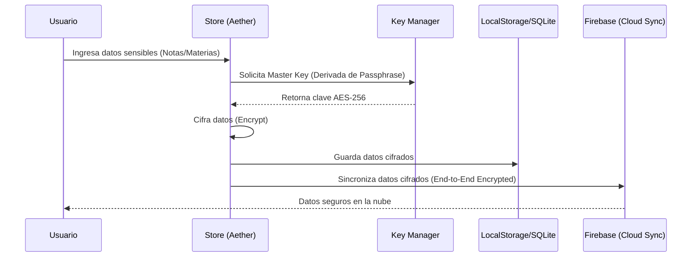
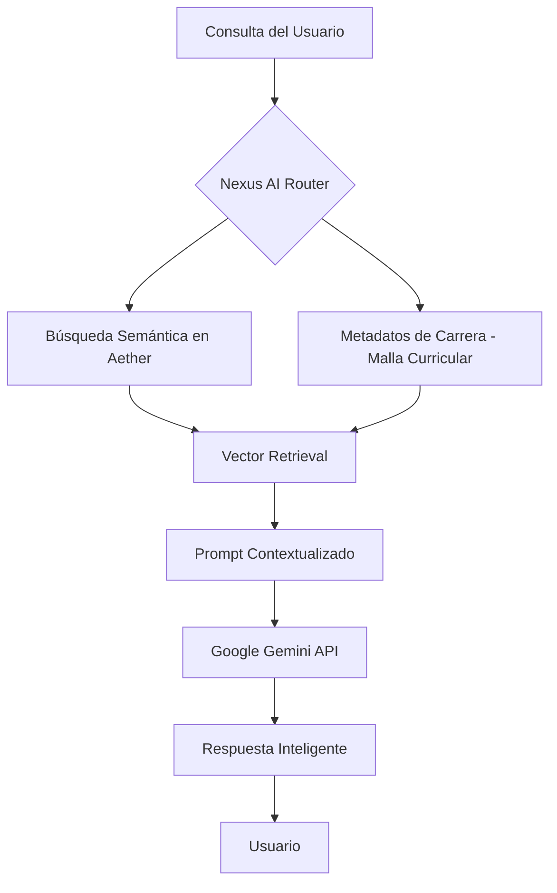
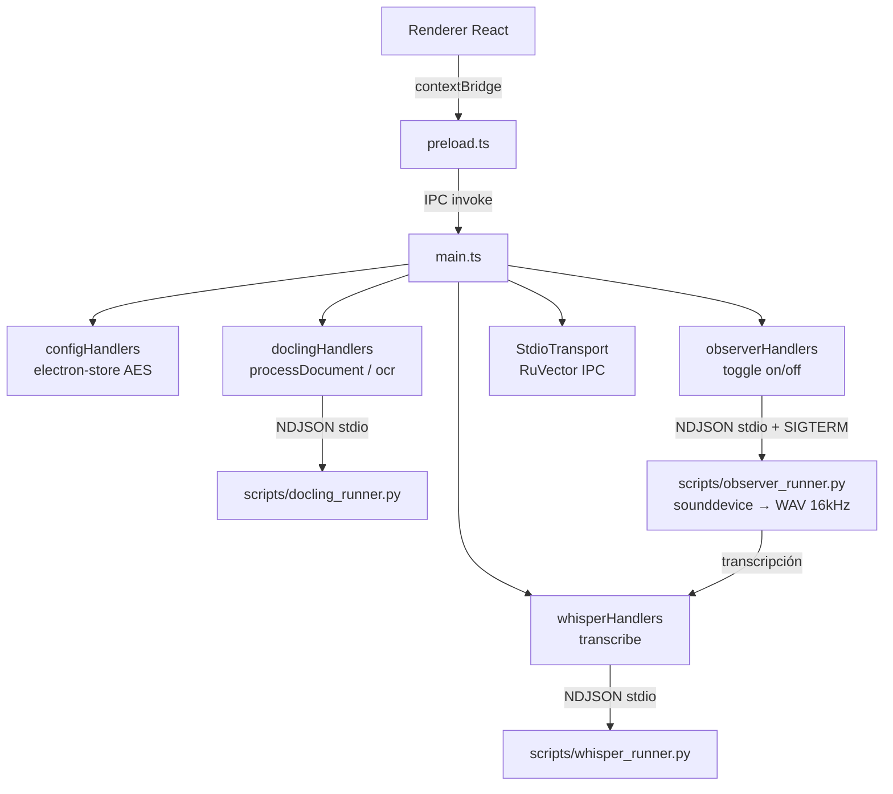
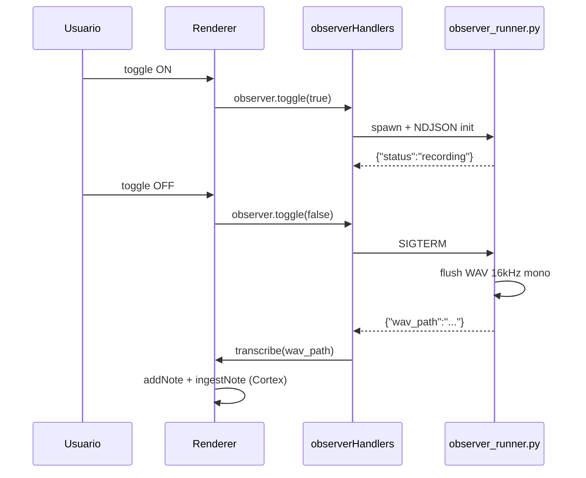
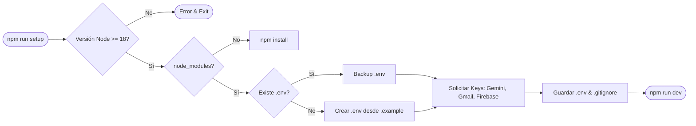

# Diagramas de Arquitectura - Carrera LTI

Este documento detalla visualmente los procesos críticos de seguridad y flujo de datos dentro del ecosistema Carrera LTI.

## 1. Seguridad de Datos (Local-First AES-256)
Carrera LTI utiliza cifrado simétrico AES-256 para asegurar que los datos sensibles del estudiante nunca salgan del dispositivo en texto plano.

## 2. Flujo Nexus AI (RAG - Retrieval Augmented Generation)
Nexus utiliza un motor de recuperación para contextualizar las respuestas de la IA con la información académica del usuario.

## 3. Arquitectura Electron — Cortex IPC

En modo escritorio (Electron v3.0+), el proceso principal orquesta subprocesos Python mediante `StdioTransport` (NDJSON stdio).

### Ciclo Observer AI

## 4. Flujo de Configuración (Setup Wizard)
El proceso automatizado de onboarding mediante el CLI.

