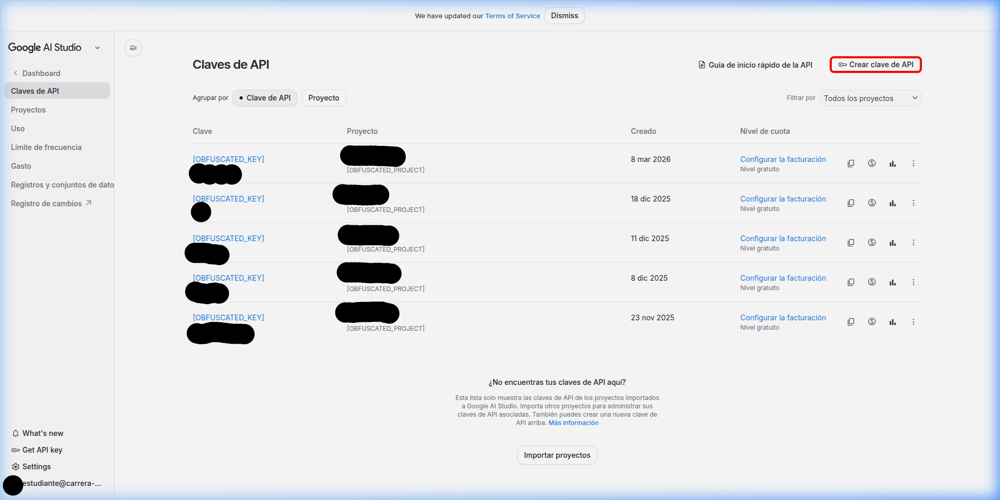
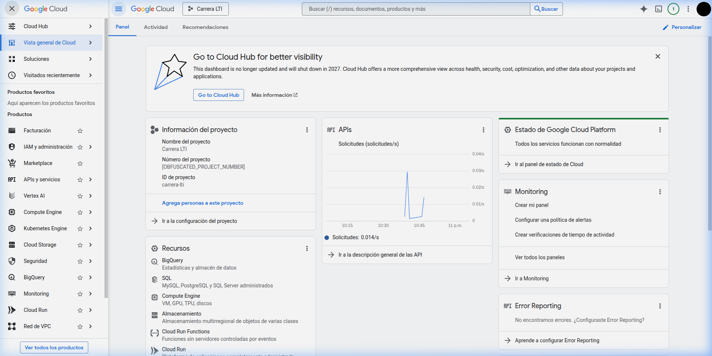
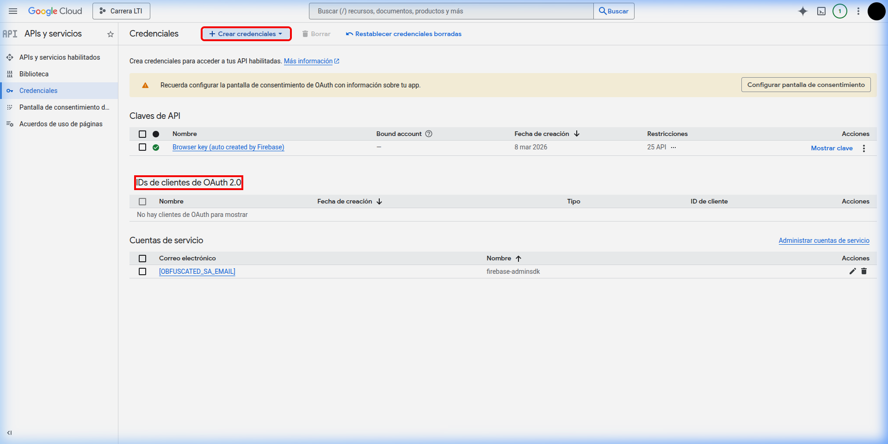
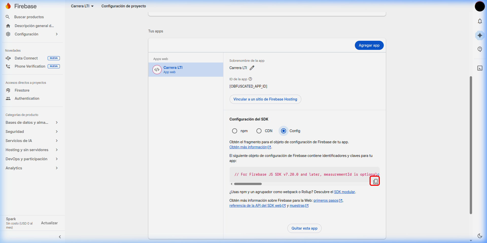

# Guía Visual de Configuración de APIs

Esta guía proporciona el paso a paso visual para obtener las credenciales necesarias para el ecosistema Carrera LTI.

---

<!-- LINKS RESTAURADOS CON OFUSCACIÓN CRÍTICA -->

## 1. Google Gemini API (Aether AI)
Para dotar a Aether de inteligencia, necesitas una clave de API de Google AI Studio.

1. Ingresa a [Google AI Studio](https://aistudio.google.com/app/apikey).
2. Haz clic en **"Get API key"** (marcado en rojo).
3. Selecciona **"Create API key in new project"**.



---

## 2. Google Cloud - Gmail API
Gmail API permite que el sistema analice tus correos académicos para extraer fechas de exámenes y tareas.

### A. Dashboard de Proyecto
Asegúrate de estar en el proyecto `carrera-lti` (o crear uno nuevo).



### B. Configurar OAuth 2.0
Ve a **API y servicios > Credenciales**. Crea un "ID de cliente de OAuth" (Tipo: Aplicación Web).
- **Redirigir URIs**: Ingresa `http://localhost:5173/`.



---

## 3. Firebase (Sincronización en la Nube)
Firebase se encarga de que tus datos estén seguros y sincronizados entre dispositivos.

1. Entra a "Project Settings".
2. Copia el objeto `firebaseConfig` que verás en la configuración del proyecto.



---

## 🚀 Siguiente Paso: Setup Wizard
Una vez que tengas estas claves, ejecuta el script de configuración automática:

```bash
npm run setup
```
El asistente te pedirá estos valores y los guardará de forma segura en tu archivo `.env`.
