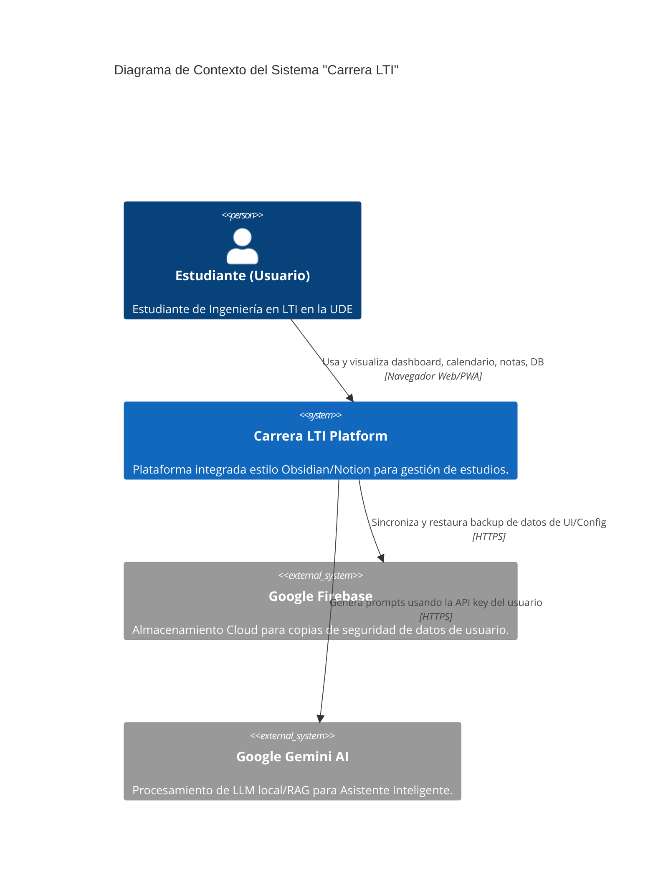
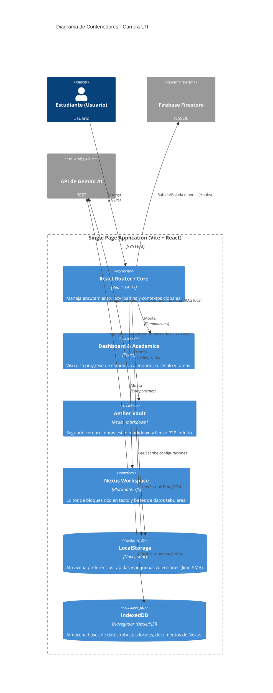

```mermaid
C4Context
    title Diagrama de Contexto del Sistema "Carrera LTI"

    Person(student, "Estudiante (Usuario)", "Estudiante de Ingeniería en LTI en la UDE")
    System(carreraLti, "Carrera LTI Platform", "Plataforma integrada estilo Obsidian/Notion para gestión de estudios.")

    System_Ext(firebase, "Google Firebase", "Almacenamiento Cloud para copias de seguridad de datos de usuario.")
    System_Ext(gemini, "Google Gemini AI", "Procesamiento de LLM local/RAG para Asistente Inteligente.")

    Rel(student, carreraLti, "Usa y visualiza dashboard, calendario, notas, DB", "Navegador Web/PWA")
    Rel(carreraLti, firebase, "Sincroniza y restaura backup de datos de UI/Config", "HTTPS")
    Rel(carreraLti, gemini, "Genera prompts usando la API key del usuario", "HTTPS")
```

```mermaid
C4Container
    title Diagrama de Contenedores - Carrera LTI

    Person(student, "Estudiante (Usuario)", "Usuario")

    System_Boundary(c1, "Single Page Application (Vite + React)") {
        Container(router, "React Router / Core", "React 19, TS", "Maneja enrutamiento, lazy loading y contextos globales.")
        Container(dashboard, "Dashboard & Academics", "React", "Visualiza progreso de estudios, calendario, currículo y tareas.")
        Container(aether, "Aether Vault", "React, Markdown", "Segundo cerebro, notas estilo markdown y lienzo P2P infinito.")
        Container(nexus, "Nexus Workspace", "Blocknote, YJS", "Editor de bloques rico en texto y bases de datos tabulares.")
        
        ContainerDb(localStorage, "LocalStorage", "Navegador", "Almacena preferencias rápidas y pequeñas colecciones (limit 5MB).")
        ContainerDb(indexedDb, "IndexedDB", "Navegador (Dexie/YJS)", "Almacena bases de datos robustas locales, documentos de Nexus.")
    }

    System_Ext(firebase, "Firebase Firestore", "NoSQL", "Cloud Syncing a demanda (no realtime)")
    System_Ext(gemini, "API de Gemini AI", "REST", "Asistente AI")

    Rel(student, router, "Navega", "HTTPS")
    Rel(router, dashboard, "Monta", "Componentes")
    Rel(router, aether, "Monta", "Componentes")
    Rel(router, nexus, "Monta", "Componentes")

    Rel(dashboard, localStorage, "Lee/Escribe configuraciones")
    Rel(aether, localStorage, "Lee/Escribe Data JSON")
    Rel(nexus, indexedDb, "CRUD Documentos ricos")

    Rel(router, firebase, "Subida/Bajada manual (Hooks)")
    Rel(aether, gemini, "Pregunta a Gemini con contexto de notas (RAG local)")
    Rel(nexus, gemini, "Pregunta a Gemini con contexto de BDs y Docs")
```
