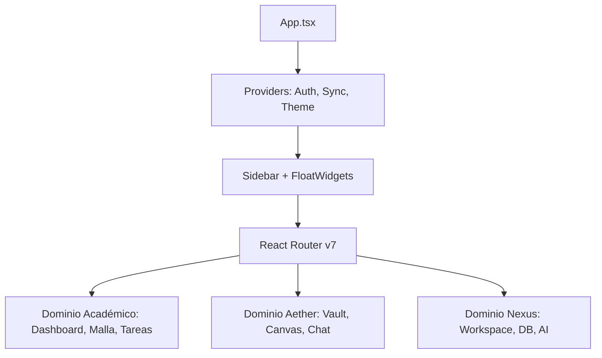
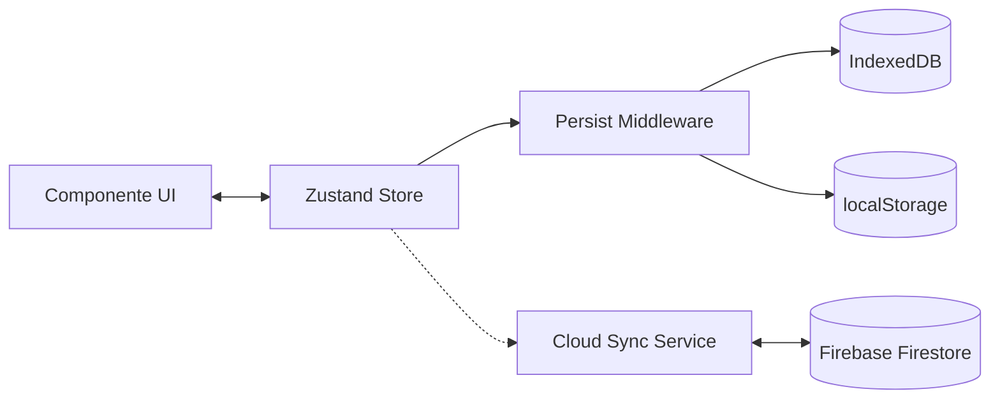

# Documentación Técnica Pro: Carrera LTI

Este documento es una exportación completa y estructurada del conocimiento técnico de Carrera LTI, diseñada para la Wiki oficial del proyecto.

---

## 🏗️ 1. Arquitectura del Sistema

### Visión General
Carrera LTI es una **Super-App Local-First** construida con React 19 y Vite 6. Su arquitectura se basa en la separación estricta de tres dominios funcionales que comparten una capa de datos unificada.

### Diagrama de Arquitectura de Enrutamiento

---

## 🧠 2. Gestión de Estado y Datos

### Arquitectura de Stores (Zustand)
El estado se divide en 4 almacenes especializados, cada uno con su propia lógica de mutación mediante **Immer**.

| Store | Responsabilidad | Persistencia |
| :--- | :--- | :--- |
| `useAetherStore` | Notas, Chat, Grafos, RAG | IndexedDB (Dexie) |
| `useNexusStore` | Documentos Colaborativos | IndexedDB (Yjs) |
| `useNexusDB` | Bases de Datos Relacionales | IndexedDB (Dexie) |
| `useSubjectData` | Progreso Académico | localStorage |

### Diagrama de Flujo de Datos

---

## 🛡️ 3. Seguridad y Validación

### Validación en Fronteras de Confianza
Para garantizar la integridad de los datos entre el Navegador, IndexedDB y la Nube, utilizamos **Zod** como motor de validación en tiempo de ejecución.

- **Frontera 1 (Entrada)**: Validación de entrada de usuario en formularios.
- **Frontera 2 (Persistencia)**: Validación antes de escribir/leer de IndexedDB.
- **Frontera 3 (Sincronización)**: Validación estricta de esquemas antes de subir a Firebase.

---

## 🎓 4. Dominio Académico (Plan 2024)

### Malla Curricular e Hitos
La Malla Curricular no es solo visual; contiene la lógica de negocio para el cálculo de créditos de la **Licenciatura en TI**.
- **Hito de Tecnicatura**: Se activa automáticamente al completar los créditos de los primeros 4 semestres.
- **Estado de Materia**: Pendiente, En Curso, Aprobada, Reprobada.

### Gestión de Tareas (Kanban)
- **Notificaciones**: Sistema nativo del navegador para alertas de entrega.
- **Priorización**: Lógica de semáforo (Alta/Media/Baja) vinculada a materias específicas.

---

## 🚀 5. Aether: El Segundo Cerebro

Aether utiliza técnicas avanzadas de **IA Local** para potenciar el estudio.

### RAG (Retrieval-Augmented Generation) Local
1. **Ingestión**: La nota se fragmenta y se genera un embedding de 768 dimensiones localmente.
2. **Búsqueda Semántica**: Se realiza una comparación vectorial (similitud de coseno) en el navegador.
3. **Contexto AI**: Solo los fragmentos relevantes se envían como contexto a Gemini para responder dudas sobre tus propios datos.

---

## 🔗 6. Nexus: Espacio de Trabajo Inteligente

Nexus integra la potencia de un editor de bloques con análisis multidominio.

- **Editor de Bloques (BlockNote)**: Estructura jerárquica de contenido.
- **NexusAI**: Capacidad de "preguntar" a todo tu espacio de trabajo (Notas + Documentos + Bases de Datos) simultáneamente.

---
*Fuente: Documentación Técnica Consolidada de [DeepWiki](https://deepwiki.com/JantonioFC/Carrera-LTI)*
