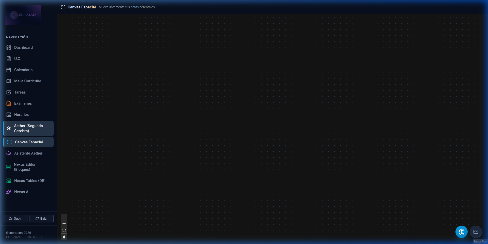
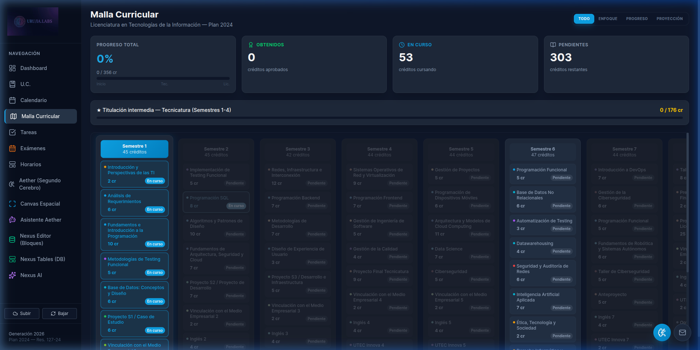

# 🛠️ Guía Técnica de Instalación y Configuración — Carrera LTI

Esta guía detalla los pasos para configurar el entorno de desarrollo, bases de datos y servicios de IA para el proyecto **Carrera LTI**.

---

## 1. Arquitectura de Datos y APIs

La aplicación sigue un enfoque **Local-First**:
- **Almacenamiento Primario**: IndexedDB (vía [Dexie.js](https://dexie.org/)) para bases de datos relacionales (Nexus) y [idb-keyval](https://github.com/jakearchibald/idb-keyval) para el Segundo Cerebro (Aether).
- **Sincronización Cloud**: Firebase (Firestore + Auth) se utiliza como respaldo opcional y persistencia entre dispositivos.
- **Inteligencia Artificial**: Integración directa con Google Gemini API y Gmail API para monitoreo de bandeja de entrada.

---

## 2. Requisitos Previos

- **Node.js**: v18.0.0 o superior.
- **Gestor de Paquetes**: npm (incluido con Node).
- **Cuentas**:
  - [Google AI Studio](https://aistudio.google.com/) (para Gemini API Key).
  - [Firebase Console](https://console.firebase.google.com/) (para sincronización cloud).
  - [Google Cloud Console](https://console.cloud.google.com/) (para Gmail API).

---

## 3. Instalación Local

La forma recomendada de instalar y configurar el proyecto es a través del asistente interactivo:

```bash
# 1. Clonar el repositorio
git clone <URL_DEL_REPOSITORIO>
cd "Carrera LTI"

# 2. Ejecutar el Setup Wizard
# Esto instalará dependencias, validará tu entorno y configurará el .env
npm run setup
```

El asistente te guiará para configurar las claves de Gemini, Gmail y Firebase de forma segura. Si necesitas ayuda visual para obtener tus credenciales, consulta la **[Guía Visual de Configuración (PDF)](GUIA_VISUAL_CONFIGURACION.pdf)** o la [versión Markdown](GUIA_VISUAL_CONFIGURACION.md).

Una vez completado, puedes iniciar el servidor con `npm run dev`.

---

## 4. Configuración de Base de Datos

### 4.1 Base de Datos Local (Offline)
No requiere configuración manual. La app inicializa automáticamente los esquemas de **Dexie** al cargar el componente `useNexusDB`.
- **Base de datos principal**: `NexusEngineDB`
- **Almacenamiento de notas**: `aether-storage` (vía Zustand persist middleware)

### 4.2 Sincronización Cloud (Firebase)
1. Crea un proyecto en [Firebase Console](https://console.firebase.google.com/).
2. Habilita **Firestore Database** en modo producción o prueba (ajusta las reglas según `firestore.rules`).
3. Habilita **Authentication** y activa el método **Anónimo**.
4. En la configuración del proyecto, añade una "Web App" y obtén el objeto `firebaseConfig`.
5. Copia los valores correspondientes a tu archivo `.env`.

---

## 5. Configuración de APIs

### 5.1 Google Gemini AI
1. Obtén tu API Key en [aistudio.google.com](https://aistudio.google.com/).
2. **Método A (Automático - Recomendado)**: Ejecuta `npm run setup` y pega la clave cuando se solicite. El asistente la guardará en el archivo `.env`.
3. **Método B (Interfaz)**: Puedes ingresar o cambiar la clave directamente desde la configuración de Aether dentro de la aplicación.

### 5.2 Gmail API (OAuth 2.0)
Requerido para el widget de Gmail en el Dashboard:
1. Ve a [Google Cloud Console](https://console.cloud.google.com/).
2. Crea un nuevo proyecto.
3. Habilita la **Gmail API**.
4. Configura la **Pantalla de Consentimiento OAuth** (tipo Externo, añade tu email como usuario de prueba).
5. Crea **Credenciales**:
   - **ID de cliente de OAuth 2.0**: Tipo "Aplicación Web". Añade `http://localhost:5173` a los "Orígenes de JavaScript autorizados".
   - **Clave de API**: Para acceso a discovery docs.
6. Copia el `Client ID` y la `API Key` a la configuración de la app (vía sidebar o `aetherStore`).

---

## 6. Variables de Entorno (.env)

| Variable | Descripción |
|----------|-------------|
| `VITE_FIREBASE_API_KEY` | API Key de tu proyecto Firebase. |
| `VITE_FIREBASE_AUTH_DOMAIN` | Dominio de auth (ej. `app.firebaseapp.com`). |
| `VITE_FIREBASE_PROJECT_ID` | ID único de tu proyecto Firebase. |
| `VITE_FIREBASE_STORAGE_BUCKET` | URL del bucket de almacenamiento. |
| `VITE_FIREBASE_MESSAGING_SENDER_ID` | ID del remitente para notificaciones. |
| `VITE_FIREBASE_APP_ID` | ID único de la aplicación web en Firebase. |
| `VITE_FIREBASE_MEASUREMENT_ID` | ID de Google Analytics (opcional). |
| `VITE_GEMINI_API_KEY` | Llave para el motor de IA Nexus/Aether. |
| `VITE_GMAIL_CLIENT_ID` | Client ID de Google Cloud para el widget de Gmail. |
| `VITE_GMAIL_API_KEY` | API Key de Google Cloud para descubrimiento de servicios. |

---

## 7. Despliegue (Production Build)

La aplicación es una PWA estática que puede alojarse en cualquier servidor, pero está pre-configurada para **Firebase Hosting**:

```bash
# 1. Instalar Firebase Tools
npm install -g firebase-tools

# 2. Login e inicio
firebase login
firebase init hosting # Seleccionar carpeta 'dist'

# 3. Compilar y desplegar
npm run build
firebase deploy
```

> [!IMPORTANT]
> Asegúrate de configurar las reglas de Firestore (`firestore.rules`) antes de producción para garantizar que solo los usuarios autenticados (incluso de forma anónima) puedan acceder a sus propios datos.
## Resumen de la Interfaz
| Sección | Captura de Pantalla |
| :--- | :--- |
| Dashboard |  |
| Editor Aether |  |
| Canvas Espacial |  |
| Editor Nexus |  |
| Malla Curricular |  |

---

## Diagramas y Flujos Críticos
Consulta el documento [DIAGRAMAS_ARQUITECTURA.md](DIAGRAMAS_ARQUITECTURA.md) para ver detalles sobre:
- Cifrado AES-256 Local-First.
- Arquitectura RAG (Retrieval Augmented Generation).
- Flujo lógico del Setup Wizard.

Para una guía paso a paso con capturas de pantalla, consulta la **[Guía Visual de Configuración (PDF)](GUIA_VISUAL_CONFIGURACION.pdf)**.
