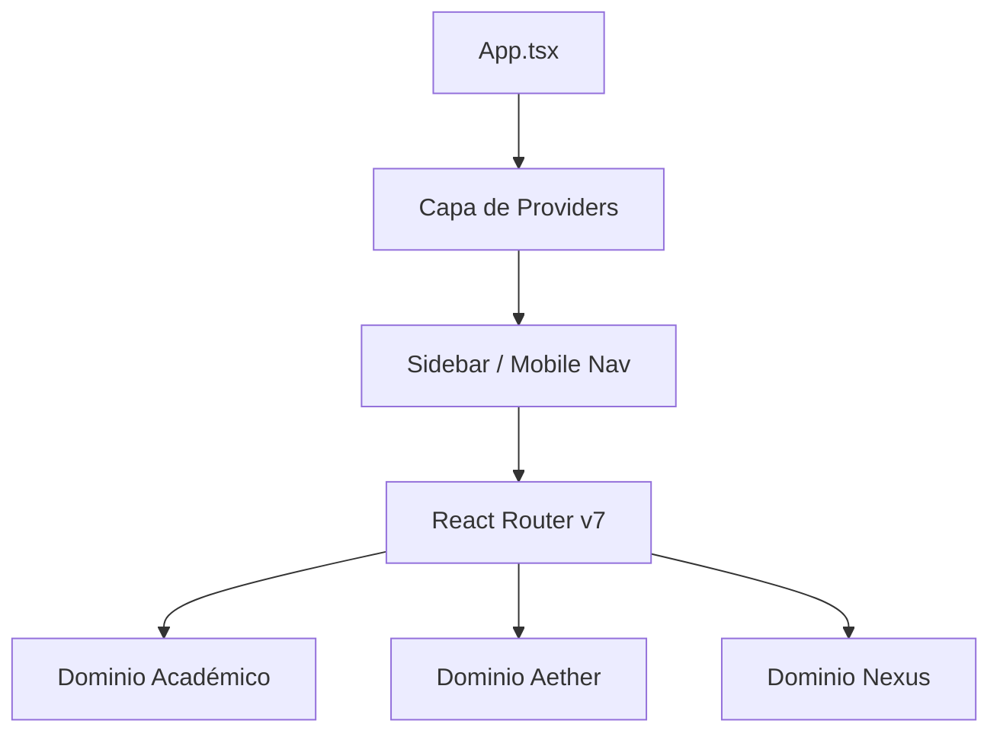

# Arquitectura del Sistema

Carrera LTI utiliza una arquitectura moderna de **Single Page Application (SPA)** centrada en el rendimiento, la capacidad offline y la privacidad del usuario.

## 🏗️ Visión General
La aplicación se basa en **React 19** y **Vite 6**, estructurada en tres dominios principales que comparten una capa de infraestructura común.

### Diagrama de Flujo

## 🛤️ Enrutamiento y Navegación
Utilizamos **React Router v7** para gestionar 13 rutas funcionales. Todas las rutas están protegidas por `React.lazy` para garantizar que solo se cargue el código necesario en cada momento.

### Rutas Principales
- `/`: Dashboard Central.
- `/malla`: Visualización del progreso académico.
- `/aether`: Entrada al Segundo Cerebro.
- `/nexus`: Acceso al espacio de trabajo.

## ⚡ Rendimiento
- **Code Splitting**: Reducción del bundle inicial mediante lazy loading.
- **Framer Motion**: Transiciones suaves entre estados y páginas para una experiencia "Premium".
- **Web Workers**: Procesamiento pesado de IA y búsqueda semántica fuera del hilo principal.

---
[[Ir a Inicio|Home]] | [[Gestión de Estado|Estado]]
