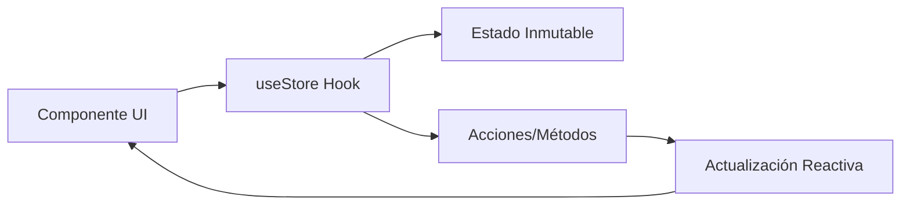

# Gestión de Estado (Zustand)

El estado de Carrera LTI es la columna vertebral de la aplicación. Utilizamos **Zustand** para una gestión de estado reactiva, ligera y altamente desacoplada.

## 🧠 Arquitectura de Stores
Dividimos el estado global en cuatro almacenes (stores) especializados para evitar mutaciones innecesarias y mejorar la claridad.

| Store | Propósito | Tecnología Clave |
| :--- | :--- | :--- |
| `useAetherStore` | Notas, Grafos, Chat AI | `persist` + `immer` |
| `useNexusStore` | Editor de bloques | `Yjs` (CRDT) |
| `useNexusDB` | Bases de Datos | `Dexie` |
| `useSubjectData` | Datos LTI (UTEC) | `localStorage` |

## 🛠️ Patrón de Implementación
Cada store sigue un patrón estricto para garantizar la seguridad de tipos:
1.  **Interfaces de Estado**: Definición de los datos.
2.  **Interfaces de Acciones**: Métodos para mutar el estado.
3.  **Middlewares**:
    - **Immer**: Permite escribir lógica mutable que se traduce en actualizaciones inmutables.
    - **Persist**: Gestiona automáticamente el guardado y carga desde el almacenamiento local.

## 🔄 Flujo de Datos

---
[[Arquitectura|Arquitectura]] | [[Persistencia de Datos|Persistencia]]
